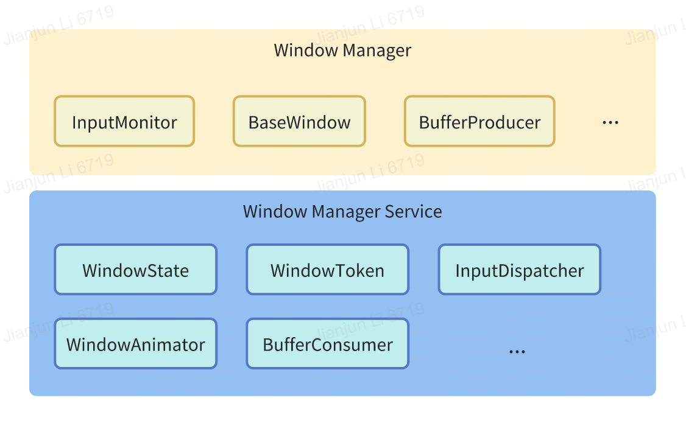

# Window Manager

[English|[简体中文](./README_zh-cn.md)]

## Introduction
Window management is one of the services in the openvela operating system, mainly responsible for input management, output management, and display management.

## Architecture
**Figure 1** Window management service architecture

- **Window Manager**

    The client-side window management of the application runs in the application user space, responsible for window management and rendering within the application, and passes the rendered image to the server.

- **Window Manager Server**

    The server-side window management service runs as a core system capability in the kernel system service process, responsible for window management, scheduling, and composition between applications.

## Features
- Window attribute and style management: including adjusting window position, size, and transparency.
- Window lifecycle management: including creating, displaying, hiding, and deleting windows.
- Event listening management.
- Window transition animation management.

## Directory
```
├── app
├── common
├── config
├── include
├── Kconfig
├── server
└── test
```
## Constraints

- The .Kconfig file is used to configure compilation options for the window management service.
- Language version: C++11 or higher.
- Dependencies: openvela Core service.

## Usage

The following lists the basic usage of window management on the native application side.

### Get window management service

To get an instance of the window management service, use the following code:

```c++
WindowManager windowManager = (WindowManager) getService(WindowManager::name());
```

### Create a window

Use WindowManager.LayoutParams to create a window, as shown below:

```c++
WindowManager.LayoutParams layoutParams = new WindowManager.LayoutParams();
layoutParams.type = WindowManager.LayoutParams.TYPE_APPLICATION;
layoutParams.format = PixelFormat.FORMAT_RGB_888;
layoutParams.width = WindowManager.LayoutParams.MATCH_PARENT;
layoutParams.height = WindowManager.LayoutParams.MATCH_PARENT;
layoutParams.x = 0;
layoutParams.y = 0;
layoutParams.windowTransitionState = WindowManager.LayoutParams.WINDOW_TRANSITION_ENABLE;

BaseWindow window = new BaseWindow(context, this);
windowManager.addWindow(window, layoutParams, visibility);
```

The above code creates a window for the application and adds it to the window list managed by the window management service.

### Modify window attributes

To modify the window attributes, use the following code:

```c++
WindowManager.LayoutParams layoutParams = getWindow().getLayoutParams();
layoutParams.x = 200;
layoutParams.y = 200;
getWindow().setLayoutParams(layoutParams);
```

The above code changes the window position of the current activity to (200, 200).

### Delete the window

To delete the window, use the following code:

```c++
windowManager.removeWindow(window);
```