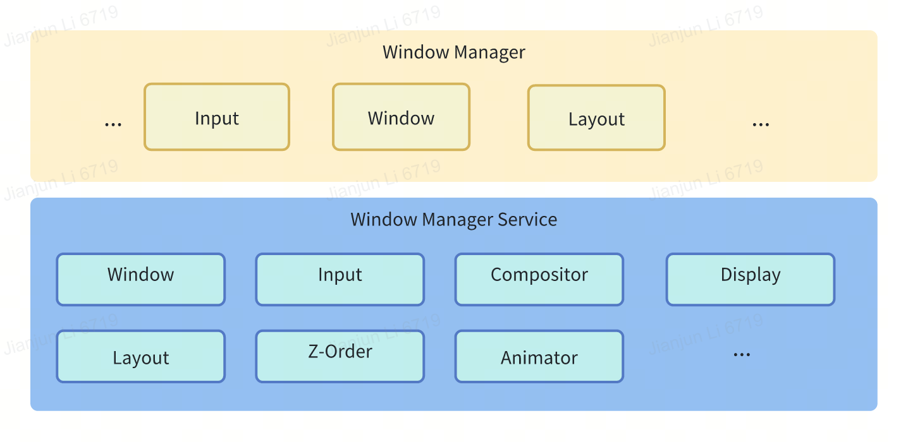

# 窗口管理

[简体中文|[English](./README.md)]

## 介绍
窗口管理是 openvela 操作系统中最重要的服务之一，主要负责输入管理、输出管理和显示管理，其主要的结构如图1所示。

**图1** 窗口管理服务架构图

- **Window Manager**

    应用侧窗口管理客户端，运行于应用用户空间，负责应用内的窗口管理和渲染，并将渲染画面传递给服务端。

- **Window Manager Server**

    服务端窗口管理服务，作为系统核心能力将运行于kernel系统服务进程，负责实现应用间的窗口管理、调度和合成。

### 功能
- 窗口属性和风格管理：包括窗口位置、大小、透明度等属性的调整
- 窗口生命周期管理：包括窗口的创建、显示、隐藏和删除
- 事件监听管理
- 窗口过渡动效管理

## 目录
```
├── wm
│   ├── aidl
│   ├── app
│   ├── CMakeLists.txt
│   ├── common
│   ├── config
│   ├── images
│   ├── include
│   ├── Kconfig
│   ├── Make.defs
│   ├── Makefile
│   ├── README.md
│   ├── README_zh-cn.md
│   ├── server
│   └── test
```
## 约束

- .Kconfig 文件用于配置窗口管理服务的编译选项 。
- 语言版本：C++11或以上
- 依赖：OpenVela Core服务

## 说明

下面列举原生应用端窗口管理基础用法

### 获取窗口管理服务

要获取窗口管理服务的实例，可以使用以下代码：

```c++
WindowManager windowManager = (WindowManager) getService(WindowManager::name());
```

### 创建窗口

使用 WindowManager.LayoutParams 来创建窗口，示例代码如下：

```c++
WindowManager.LayoutParams layoutParams = new WindowManager.LayoutParams();
layoutParams.type = WindowManager.LayoutParams.TYPE_APPLICATION;
layoutParams.format = PixelFormat.FORMAT_RGB_888;
layoutParams.width = WindowManager.LayoutParams.MATCH_PARENT;
layoutParams.height = WindowManager.LayoutParams.MATCH_PARENT;
layoutParams.x = 0;
layoutParams.y = 0;
layoutParams.windowTransitionState = WindowManager.LayoutParams.WINDOW_TRANSITION_ENABLE;

BaseWindow window = new BaseWindow(context, this);
windowManager.addWindow(window, layoutParams, visibility);
```

以上代码创建了一个应用程序的窗口，并将其添加到窗口管理服务的窗口列表中管理。

### 修改窗口属性

要修改窗口的属性，可以使用以下代码：

```c++
WindowManager.LayoutParams layoutParams = getWindow().getLayoutParams();
layoutParams.x = 200;
layoutParams.y = 200;
getWindow().setLayoutParams(layoutParams);
```

以上代码将当前 Activity 的窗口位置修改为 (200, 200)。

### 删除窗口

要删除窗口，可以使用以下代码：

```c++
windowManager.removeWindow(window);
```

