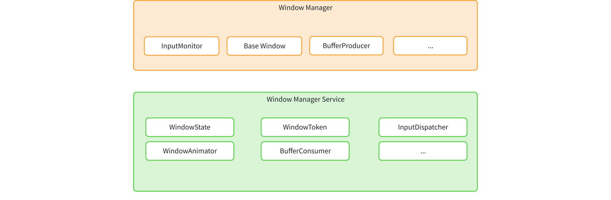

# 窗口管理

[简体中文 | [English](./README.md)]

## 概述

窗口管理服务（Window Manager Service, WMS）是 openvela 操作系统的核心服务之一。该服务主要负责系统的输入分发、输出合成以及显示管理，确保用户界面交互的流畅性与稳定性。

### 核心功能

窗口管理服务提供以下核心能力：

- **窗口属性与风格管理**：支持动态调整窗口位置、尺寸、透明度（Alpha）及层级（Z-Order）。
- **生命周期管理**：提供窗口创建、显示、隐藏及销毁的全生命周期控制接口。
- **事件分发**：管理输入事件的监听与派发。
- **过渡动画**：支持窗口切换时的过渡动效管理。

## 架构说明

openvela 的窗口管理采用客户端/服务端（Client-Server）分离架构，其结构如图 1 所示。

**图1** 窗口管理服务架构图



### 组件职责

- **Window Manager Client（应用侧）**

    - 运行于**应用用户空间（User Space）**。
    - 负责应用程序内部的窗口管理与图形渲染。
    - 通过 IPC 机制将渲染后的缓冲区（Buffer）提交给服务端。

- **Window Manager Server（服务侧）**

    - 作为核心系统服务运行于**内核空间或系统服务进程**。
    - 负责全局窗口的调度、层级管理及多窗口画面的最终合成（Composition）。

## 目录结构

```text
├── app         # 应用程序接口及示例
├── common      # 公共数据结构与工具库
├── config      # 配置文件
├── include     # 对外头文件
├── Kconfig     # 构建配置描述文件
├── server      # 窗口管理服务核心实现
└── test        # 测试用例
```

## 约束与依赖

在开发或集成窗口管理服务前，请遵循以下约束：

- **构建配置**：需通过 `Kconfig` 文件配置窗口管理服务的编译选项。
- **语言标准**：C++11 或更高版本。
- **系统依赖**：必须依赖 **Vela Core** 服务运行。

## 开发指南

本节介绍如何在原生应用中调用窗口管理接口。

### 1. 获取窗口管理服务实例

通过服务名称获取窗口管理服务的客户端代理对象。

```c++
WindowManager windowManager = (WindowManager) getService(WindowManager::name());
```

### 2. 创建窗口

配置 `LayoutParams` 属性并添加新窗口。

```c++
// 初始化窗口布局参数
WindowManager.LayoutParams layoutParams = new WindowManager.LayoutParams();
layoutParams.type = WindowManager.LayoutParams.TYPE_APPLICATION;   // 设置窗口类型为应用窗口
layoutParams.format = PixelFormat.FORMAT_RGB_888;                  // 设置像素格式
layoutParams.width = WindowManager.LayoutParams.MATCH_PARENT;      // 宽度匹配父容器
layoutParams.height = WindowManager.LayoutParams.MATCH_PARENT;     // 高度匹配父容器
layoutParams.x = 0;                                                // 初始 X 坐标
layoutParams.y = 0;                                                // 初始 Y 坐标
layoutParams.windowTransitionState = WindowManager.LayoutParams.WINDOW_TRANSITION_ENABLE; // 启用过渡动画

// 创建并添加窗口
BaseWindow window = new BaseWindow(context, this);
windowManager.addWindow(window, layoutParams, visibility);
```

以上代码创建了一个应用程序的窗口，并将其添加到窗口管理服务的窗口列表中管理。

### 3. 修改窗口属性

在窗口运行过程中，可动态更新其布局参数（如位置）。

```c++
// 获取当前窗口布局参数
WindowManager.LayoutParams layoutParams = getWindow().getLayoutParams();

// 修改坐标位置
layoutParams.x = 200;
layoutParams.y = 200;

// 应用更新后的参数
getWindow().setLayoutParams(layoutParams);
```

以上代码将当前 Activity 的窗口位置修改为 (200, 200)。

### 4. 销毁窗口

当不再需要窗口时，应主动将其移除以释放资源。

```c++
windowManager.removeWindow(window);
```
